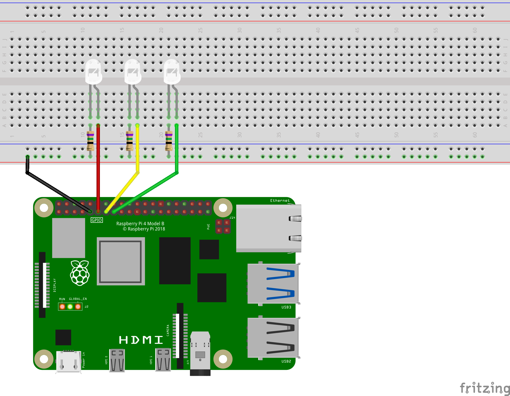
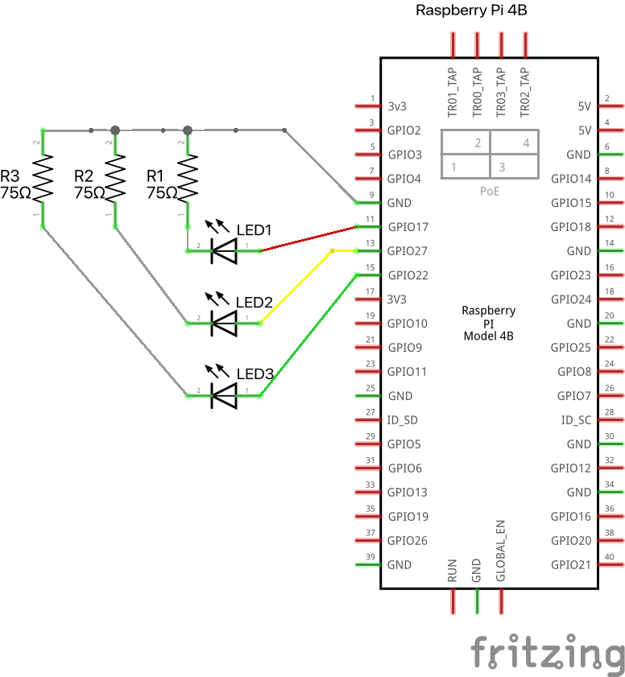
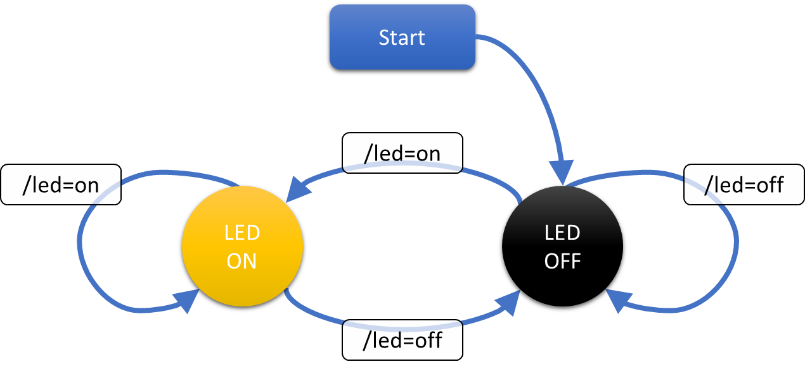
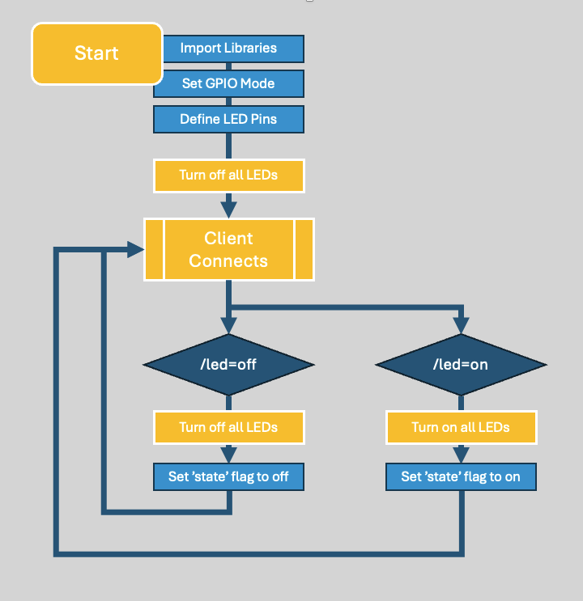

# Wifi Flashlight (Raspberry Pi)
*Example Lab for OIT Systems Academy*

## Overview ##
The wifi flashlight is an example lab for the **OIT Systems Academy**. This is purely an academic exercise, and probably isn't practical for much real-world usage. It is helpful for demonstrating the types of artifacts we should be working on in the academy, and hopefully will serve as a good example to participants.

## Design Criteria ##
Unlike **Lab 1**, there isn't a corresponding lab and use case for this. (In fact, in Lab 1, it is mentioned that Don doesn't think a wifi flashlight is a good idea.)

The idea for this stoplight is basically a dumbed down version of the **Wifi Stoplight** described in the first lab. So, we will base some of our requirements on that same case study.

### Deliverables ###
Here are the deliverables for this lab:
1. Design the general solution prior to coding.
    - Create a state diagram modeling the system.
    - Create a flowchart showing how the code for the system will flow.
    - Create a design document showing the requirements, considerations, configurations, etc that influenced the system's design
2. Utilize Github (or some other source control) to manage versions and track the development process of the system.
3. Utilize generative AI for pair programming to develop the solution.
4. Start with a minimum viable product and iterate, adding new features as the system evolves until it meets the success criteria.
    - Raspberry Pi with LEDs connected to GPIO that are controlled through a web application
5. Generate support documentation for the following audiences:
    - *Info for the general users* - how to connect to and use the system.
    - *Info for the help desk* to test if the system is working properly. What should they do if things aren't functioning as designed?
    - *Info for the supporting engineers* - this should include the original design documents and anything else necessary to support the solution moving forward. 

These are the engineering specifics of what we want the python script to do:
- Be built on a Raspberry Pi.
- Create a python webserver (flask?) to serve a web page.
    - (Required) The webpage **must** allow the user to turn on or off a light.
    - (Desired) The page **could** be done with a cool slider or switch that is very intuitive for users to follow. This would probably cut down on user support tickets.
    - (Assume) Multiple users may try to connect to the webpage at the same time. This will probably require the webpage to sync states with the lights on the raspberry pi.
    - (Desired) Can you make the lights transition (fade) between states to soften turning on or off?
    - (Not Sure) Should we have the HTML in a seperate template file, or should it be a single file?

These are some of my thoughts - they aren't explicitly described, but I'm planning to incorporate them.
 - I think I would like to do 3 LEDs instead of 1. This will be brighter.
 - I *could* build all 3 LEDs in a parallel circuit, but it would overdrive a single GPIO pin (drawing 60 mA). I think it makes more sense to put each LED on a seperate GPIO pin, and programatically treat them all as one. This means I could do some cool transitions by turning them on staggered or sequentially or something to give a cool effect.
 - I will need 3 GPIO pins, and one ground pin on the Raspberry Pi. For simplicity's sake, I would love to have them all in a row. If I use the GND Pin (9) and then GPIO17, GPIO27, and GPIO22, they should all line up nice and cleanly. I will also use three different colored jumpers, so I can make sure that we maintain consistency throughout the circuit.
 - For my circuits, I know that I will need a resistor for each LED. In consulting https://ledcalculator.net/#p=3.3&v=1.8&c=20&n=1&o=w , it says that I need a 75-Ohm resistor for the circuit. Each of the individual LED circuits can share a ground back to my Raspberry Pi.
 - Given these considerations, this is my plan for how the hardward should be built:
   
   
- I will probably need AJAX to sync the backend with the web page. This could get more chatty for the front end to keep up constant communication, but it is worth the cost.

#### State Diagram ####
After reviewing the requirements, I put together this simple state diagram of how the system should function:

It is a pretty basic design, but that seems like it should work well.

#### Flowchart ####
My flowchart of how the code should execute seems very similar to the state diagram. With a system this basic, I don't think there are a lot of nuances in the code. I'm guessing that I'll define a few functions, so I may come back and update this to reflect those.

#### Design Document ####
For my project, this file *(design.md)* serves as my design document.

#### Generative AI Coding ####
Part of this project was using genAI to do the coding for me. I kept the log of the prompts I used and the outputs. You can see all of that here:

