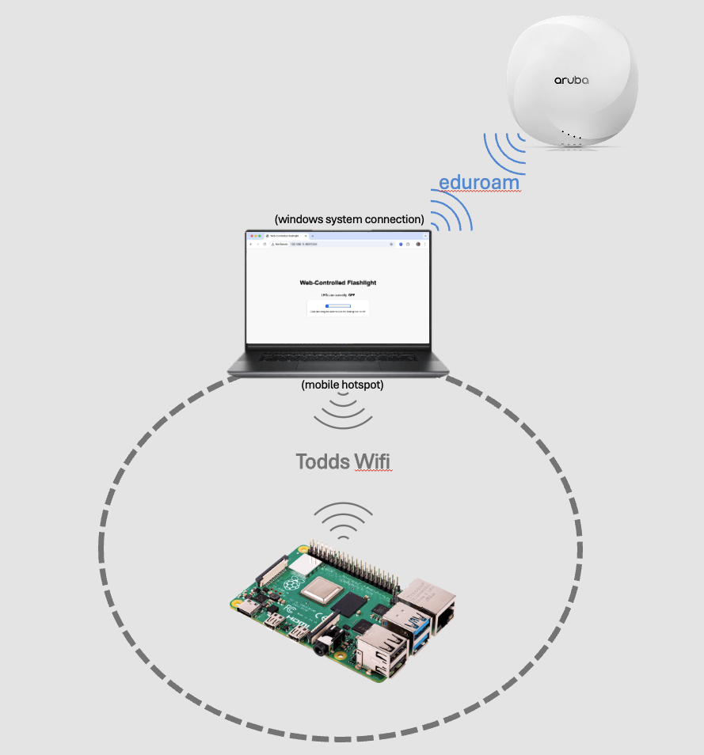
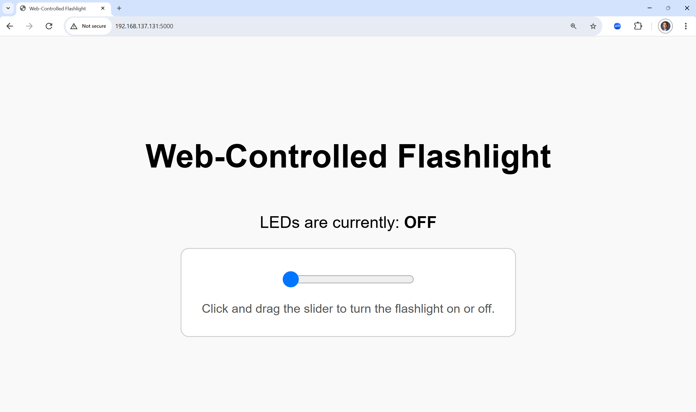
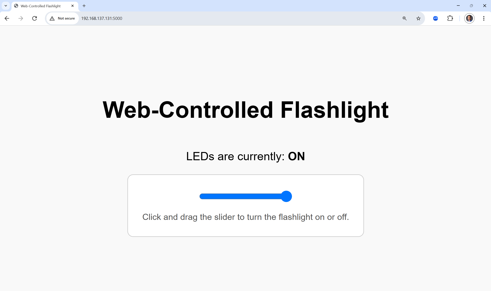

# Web-Server Controlled WiFi Flashlight #
## End User Documentation ##

This document is intended for the consumers of this system to make sure that they know how to operate the Wi-Fi controlled flashlight. The purpose of the device is to provide a remote way to control some LEDs. It can be controlled directly by the user (through a web browser) or it may be controlled via GET calls to the URL. This makes the device useful as part of a physical automation system.

### Connecting to the Device ###

#### Connect to the Same Wi-Fi ####
This device is intended to be very easy to access and use. In order to minimize the security risks associated with this device, it has network-based security. In order to be able to control the device, you must be connected to the same wifi network as the device, as shown in this diagram:

In order to control the device, the user will need to connect his/her computer to the same wifi as this light. This will limit who has the ability to control the stoplight.

This should be done in the Operating System of the client device. Please note that it is not possible to control this stoplight from the BYU eduroam or BYU-WiFi networks.

#### Open a Browser and Connect to the Webpage ####

Once connected to the same wi-fi, you will need to open a browser and connect to the webpage of the light. To do this, you'll need the IP address of the device from the system administrator. This can vary, based on the DHCP server of the laptop. At the time this document was written, it was `192.168.137.131`.

If that address is still valid, the user would open a browser and put in the address `http://192.168.137.131:5000`. This is a little different than many websites, because it uses an IP address instead of a name, and it has a port number at the end. Without that, you won't be able to connect properly.

If you have tried that and get a message that you can't connect, please contact the system administrator and verify the IP address and that the system is running.

#### Control the light from a Web Browser ####

Controlling the light should be pretty intuitive. There is a slider showing the status of the lights:

When the blue dot on the slider bar is all the way to the left, the lights will be off. To turn on the lights, click and drag the blue circle to the right. (Or you can just click on the right end of the slider bar and it will move itself):

In this position, the interface should show that the **LEDs are Currently: On**. You should see the LEDs illuminated. If there is any problem with the LEDs matching the state reflected on the webpage, please contact the system administrator.

#### Controlling the light from an API ###

The system supports GET commands if you wish to control it programatically. In order to do so, the device that will be making the API calls must be connected to the same wifi as this device. At that point, it is controlled by simply issuing the command:

`http://<ip address>:5000/led=on` to turn on.

--OR--

`http://<ip address>:5000/led=off` to turn off.

*Example:*
`http://192.168.137.131:5000/led=on` or `http://192.168.137.131:5000/led=off`
