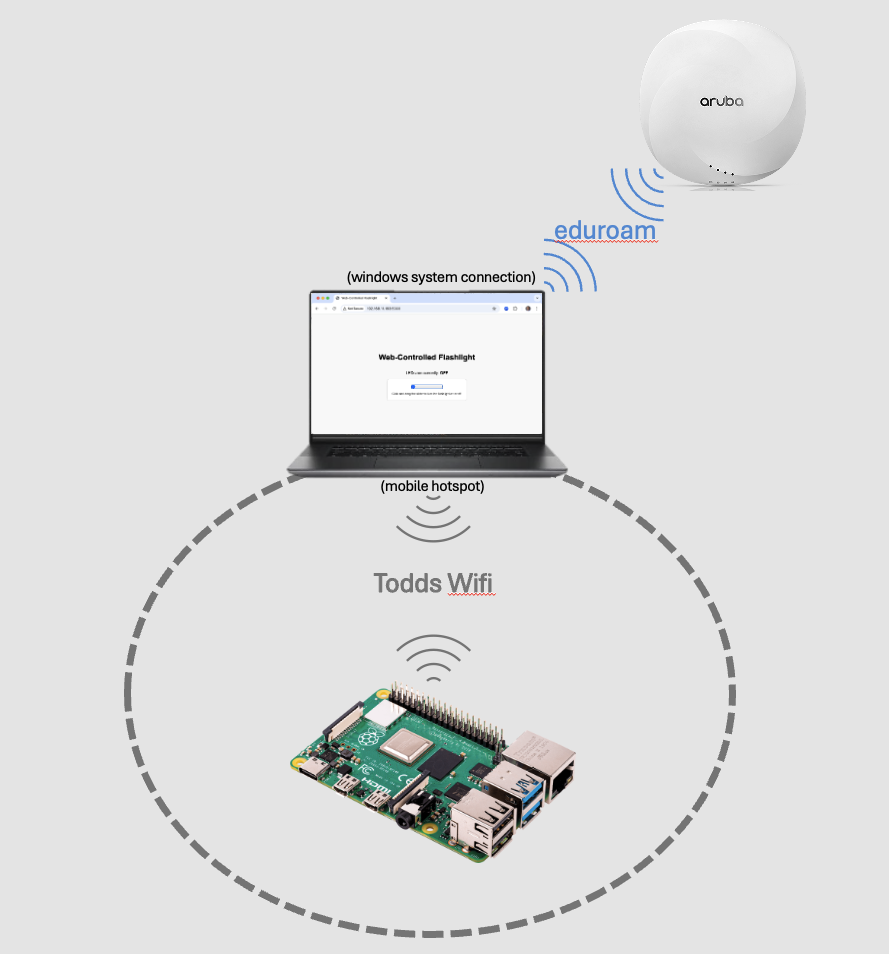

# Web-Server Controlled WiFi Flashlight #
## OPS Support Documentation ##

This document is intended for the Operations Center staff to be able to troubleshoot the Wi-Fi controlled flashlight.

For End-User documentation, please refer to 

### Connecting to the Same Network ###

This device uses network-level authentication for security. In order to communicate with the device, you must be connected to the same wifi network as the device. This is true for troubleshooting as well.

For information on how to connect to the same wifi, please refer to 

### Checking the Device ###

#### Ping Test ####
The wifi light consists of a linux controller with LEDs attached. If there is a problem with the device, the first step is to check that the linux host is powered on and operational. A quick check for this is to ping the host. In order to do so, you'll need to know the ip address of the device. If you have that, follow the following steps:
1. Connect to the same wifi
2. Open a terminal or command prompt
3. Run ping *ip address*

#### Ping Success ####
If you receive a reply (shown below) on the correct IP address, then that means that the system is up and responding.

#### Ping Failure ####

If you receive a timeout or "no route to host" response, then it means that the host is offline, or you aren't connected to the correct network.

#### Ping Success, Browser Success ####

If the system responds to pings, then you should try connecting to it with a web browser. To do this, open a browser and point it to `http://ip_address:5000`. (Example: `http://192.168.137.131:5000`). If it connects properly, you should see something similar to:

This means that the system is working properly, and the service is running properly.

#### Ping Responds, Browser Times Out ####
If you receive a reply to the ping, but your browser cannot connect, then there is likely a problem with the server itself. This should be escalated to the engineering team responsible.

